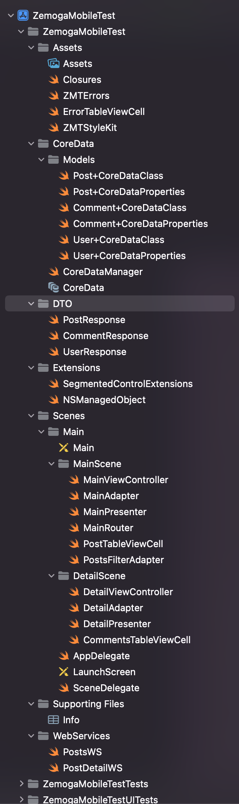

# Zemoga Mobile Test - iOS

### Description of the project

App made as a technical test to apply for a job in **Zemoga**. The app basically consists in a list of **posts**, as show in the picture below.

As requested, the posts are loaded from the [JSONPlaceholder API](https://jsonplaceholder.typicode.com/), using **URLSession** for the WebServices. No AlamoFire or similar libraries, just plain native code. 

The instructions requested that each cell/row should show the title of the post **without clipping**, so even the largest title is shown complete.

Also, once a post is tapped, the user is taken to its details view. The post detail screen contains the **user information** and the **list of comments** for the post. I also added the title and the description of the post at the top, so we get the basic info about the post.

We also have a button on each cell. It has a toggle action that adds or removes the current post to **favorites**.

To remove the current post from the list, we have the **swipe-to-delete** gesture, as shown in the picture below.

To **remove all posts**, we have a button on the right side of the navigation bar. When it's tapped, the app shows an alert to confirm if the user wants to delete all posts. If they tap on the "Delete" destructive action of the alert, every post is deleted from the app. We also trigger the **Delete service of the API**, so (in an API that really works), the posts get deleted on the server side too. Since this is a mock API, the server returns a success response, but nothing gets really deleted. This API is also called on the swipe-to-delete gesture, but just to "delete" one post from the server database.

Since the API is not real, if we swipe down to refresh the table, we get all posts back. We know they were really deleted because the returned posts don't have the favorite badge (because they're new instances that were never favorited).

When we tap on the favorite button, we get to see which ones are our favorites because it's star gets filled. But, if we want to see all of them together, just **refresh the table and all favorites will be on top**. For user experience reasons, the posts are not put on top as soon as they get favorite, since that would be confusing and the movement would make it look like the favorites post are "disappearing", especially if the user is way down on the table. So, to see all the favorites together just swipe down and you're good to go.

Of course, favorite posts should be cached. If you reopen the app, the favorites should still be there, else, having favorites wouldn't have any sense. Because of that, everything is saved on CoreData. We have a simple -yet powerful- **CoreData Model**, with entities that allow us to expand our database in case we want to add more features in the future.

I also added some **unit and UI testing**, so -if we want to upgrade the app- we get to verify really fast if our old code still works as it's supposed to. Currently, the unit testing allow us to test our core functions: listing the posts, checking if the toggle favorite works, or even if the detail shown is the right one. In our UI tests we get to check if the favorites work, the delete function, the swipe-to-delete feature, and more.

The whole code is on **GitHub** ([here!](https://github.com/dianaayalag/ZemogaMobileTestiOS.git)), and can easily be downloaded with a "git clone" command. To run it, just open the project (tap on trust if required) and just run. We don't need to install anything like a Podfile or something (perks of having all native code). 

The main reason I decided not to use third party libraries was that (when we have to develop simple functions like in this project) we can make this with simple code from the Apple devolopers documentation. Of course, when we have something complex that could take us a really long time to develop, or maybe we need private functions from third party libraries (like the Visa framework for payments), of course the advice is to use them. Frameworks and external libraries are not something terrible, but should only be used when needed.

### Description of the support, architecture and techniques used in the app

As for the architecture, this is what we have:

- The folders are sorted in alphabetical order, for an easier reading.
- First, the **Assets folder** has the Assets.xcassets folder, where pictures should be added if needed. The Closures.swift file has all the typealias for every closure in the app. This is so we get a more readable code. The ZMTErrors.swift has an enum for all the custom errors from the app. We also have a generic error if we get something outside of the declared errors. The ErrorTableViewCell is a custom class for a cell in case any table gets an error instead of data. Finally, the ZMTStyleKt.swift is an struct of constants values we could use with the UI, like colors. This is so -if we need to change one color used across the app- we only need to make the change in that file, and everything gets modified. All of the files are on the Assets folder because this are used on the whole app, and are assets of the app.
- Then, we have the **CoreData folder**, where we have all of the entity classes corresponding to CoreData, generated by XCode and expanded by me. There's also the CoreDataManager so we don't have the persistent context laying around somewhere in the AppDelegate. This manager is a sigleton that allow as to access the context and save whenever we need to. We also have the CoreData.xcdatamodeld, which is the model for the entities of the app.
- The **DTO folder** (Data Transfer Objects) has the classes that that can be decoded from the web services to get the business model classes.
- The **Extensions folder** has every extension to native classes needed for the app. Every extended class has it's own swift file. For now, there's only two extensions, but this makes the app easier to upgrade in a future.
- The **Scenes folder** has inner folders of every workflow in the app. Since this is a simple app, we only have one workflow (Main). The Main workflow has the two scenes in the app, the main one (list of posts) and the detail. Each scene is built in a sort-of **VIPER pattern/architecture**. Some elements of VIPER are not implemented because (for this app) they're not necessary. But, since the app was developed like that, those elements could be added in a future if the app was upgraded. This is a good practice because we don't need to modify much of the code to add, for instance, a router for the Detail Scene. I also added an adapter design pattern to the scenes so we don't break the Single Responsibility SOLID principle. The adapters are in charge of managing the tables, their filters and their datasource. We also have the table view cell classes needed in every scene. Of course, we have the ViewControllers, Presenters and Router. Most of the classes in every scene have their own protocols, so only the functions exposed can be accessed from the other classes. The Main folder also has the Main.storyboard, where we have the interfaces and the autolayout so it works and looks good in every iPhone model. There's also the LaunchScreen.storyboard, it has a label (with autolayout too), so we don't get a plain blank screen when loading the app. In this folder we can also find the AppDelegate, the SceneDelegate. This files weren't modified because the app was simple and we didn't need to. (As mentioned in the CoreData folder description, the AppDelegate initially had the code for the CoreData implementation, but I just moved it to the CoreData manager so we don't break the Single Responsibility principle).
- The **Supporting Files folder** has the info.plist, so it's not loose on the root of the app. If we had some more files needed for the app in the future, those could be added here (like, for instance, a Google Services plist).
- Finally, the **WebServices folder** has every web service used in the app, separated in different files according to the business model (in this case, one for fetching and deleting the posts, and one for fetching all of the detail info)

For the support, we have **iOS 14 or +** and the target is iOS 15.5. Of course, everything has been tested in iOS 14 too.

### Known bugs I couldn't fix because of lack of time 

The app has a few minor bugs I detected when testing. This bugs aren't the end of the world, just some minor stuff I would have liked to fix, but just didn't have enough time to. I sorted them in function of what my priority to fix them would be. 

1. **Reloading the table when filtered on favorites gets all posts (like it was never filtered)**. I think this has something to do with the fact that favorites are only managed by front, so it refreshes and get more info and doesn't care if those are fav or not. I know there should be a way to fix this using only front but didn't have enough time to do it
2. **"CoreAnimation: stiffness must be greater than 0" warning** when tapping on a cell and getting redirected to the detail view. This "bug" is just a warning about the animation, but we don't see anything weird on the display. It's just on the console, but it still should be fixed.
3. ~~**Posts title** when performing segue to detail. When going to th detail view (for some reason) the Posts title looks like it's glitched. Could be related to the previous bug but not sure.~~ Bug fixed with `navigationItem.largeTitleDisplayMode = .never`
4. **"2022-05-20 01:01:30.902704-0500 Zemoga Mobile Test iOS[42873:8953305] [boringssl]"** warning when launching app. Could be related to the call to the API. Requires further investigation.
5. **Switching filter with segmented controller** does not make the favorites go to top. I think this is because the segmented control event doesn't make the table reload.
